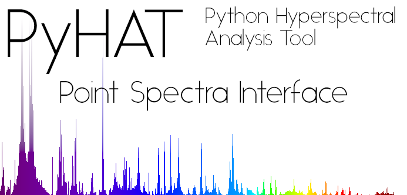

[](https://travis-ci.org/USGS-Astrogeology/PySAT_Point_Spectra_GUI) 
[](https://gitter.im/USGS-Astrogeology/PySAT?utm_source=badge&utm_medium=badge&utm_campaign=pr-badge&utm_content=badge)

## Installation

### 1. Fresh install of Miniconda (Skip to step 2 if you have Anaconda/Miniconda)

Install <a href="https://conda.io/miniconda.html">Miniconda</a>

### 2. Download the environment file

[Environment.yml](https://raw.githubusercontent.com/USGS-Astrogeology/PySAT_Point_Spectra_GUI/master/environment.yml)

### 3. Open a terminal (on Windows, `cmd`, not Powershell) in the directory where you saved the file and type:

```bash
conda install conda=3  # SKIP THIS LINE ON WINDOWS
conda env create -n point_spectra_gui -f environment.yml
source activate point_spectra_gui  # omit the `source` on Windows
```

### 4. Done! How to use point_spectra_gui

```bash
source activate point_spectra_gui  # omit the `source` on Windows
point_spectra_gui
```

### 5. Optional. Script to run the program

If you'd like to be able to run our program without having to retype **4** out, simply copy the below text into notepad, and then save it as point_spectra_gui.bat

```
call activate point_spectra_gui
point_spectra_gui
```

# PYSAT UI
  

- The UI's backend is designed and created in Python with the QT framework
- The UI is being built to work closely with the original libraries

Current Road Ahead
- [x] Ported to version 5 of PyQt
- [x] Working Modules on UI
- [x] Selecting functions from Menubar adds functions dynamically
- [x] Shortcuts such as Ctrl S to save
- [ ] Embedded Plots and Graphs from data collected
- [x] ~~Package all python packages: sklearn, scipy, numpy, matplotlib, pysat for user consumption~~ It has been discovered that the user can download Anaconda, and run our files as normal.
- [x] Add ability to delete modules
- [x] Add ability to save plots in personal files
- [x] Add ability to save state of GUI, i.e. all number that user inputs will be there again after closing GUI
- [x] Add ability to save data frame at any point in the workflow 
- [ ] Setup a way to select points on a scatter plot.

## Control Flow


- The user begins by starting \_\_main\_\_.py.
- \_\_main\_\_.py will load MainWindow.py which in turn will load the splash screen and all necessary UI pieces
- MainWindow.py displays the mainframe in which the UI's submodules will be loaded into
- MainWindow.py will then foward control to each submodule of focus
- Each of the submodules build the collective UI library
- Each submodule also contains all the necessary functions that will interact with Anaconda and PYSAT
- The PYSAT and Anaconda libraries will then do the necessary data manipulations
- The values are then returned back up to the Submodule which in turn is returned back to MainWindow which will then deal with changed data
